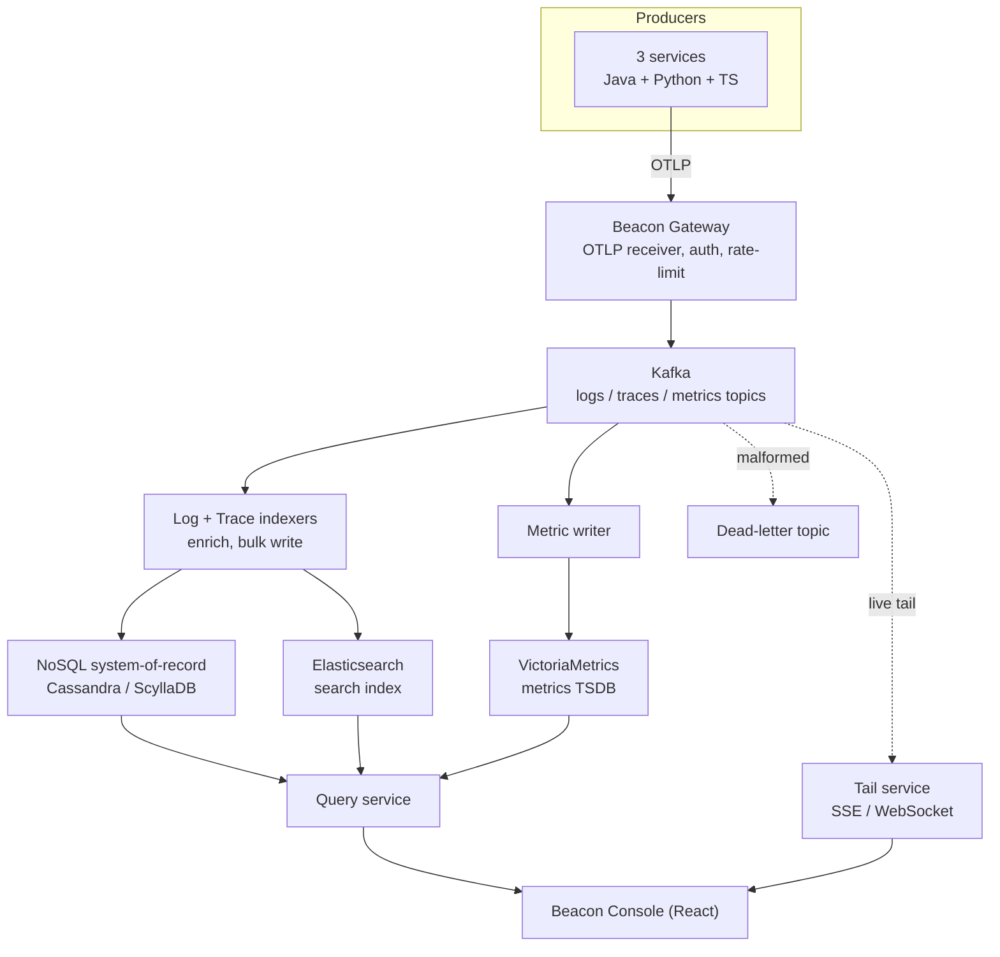

# Beacon — Unified Observability Platform
### Hybrid Product Requirements Document (PRD) + Technical Design Document (RFC)

| Field | Value |
|---|---|
| Document type | Hybrid PRD + Technical Design (RFC) |
| Status | Draft v1.1 — design decisions resolved |
| Owner | Prajwal Mahajan |
| Last updated | 2026-06-02 |
| Reviewers | Backend / Platform, SRE, Security |
| Related artifacts | Architecture diagrams (pipeline, SDK internals) |

> **How to read this document.** Part A (PRD) frames *what* we are building and *why* — problem, goals, scope, and requirements. Part B (Technical Design / RFC) covers *how* — architecture, data model, storage, APIs, SDKs, and operations. A PRD intentionally does not prescribe implementation; the design section does. They are kept side by side here because this is a single-owner platform project.

---

## Table of Contents

- [Part A — Product Requirements](#part-a--product-requirements)
  - [1. Summary](#1-summary)
  - [2. Background & problem statement](#2-background--problem-statement)
  - [3. Goals](#3-goals)
  - [4. Non-goals](#4-non-goals)
  - [5. Users & personas](#5-users--personas)
  - [6. Success metrics & SLOs](#6-success-metrics--slos)
  - [7. Scope](#7-scope)
  - [8. Functional requirements](#8-functional-requirements)
  - [9. Non-functional requirements](#9-non-functional-requirements)
  - [10. Constraints & assumptions](#10-constraints--assumptions)
- [Part B — Technical Design (RFC)](#part-b--technical-design-rfc)
  - [11. Architecture overview](#11-architecture-overview)
  - [12. Telemetry data model & schema](#12-telemetry-data-model--schema)
  - [13. Ingestion & transport](#13-ingestion--transport)
  - [14. Processing & indexing](#14-processing--indexing)
  - [15. Storage design](#15-storage-design)
  - [16. Query & API layer](#16-query--api-layer)
  - [17. Live tail & streaming](#17-live-tail--streaming)
  - [18. Frontend — Beacon Console](#18-frontend--beacon-console)
  - [19. SDK / integration design](#19-sdk--integration-design)
  - [20. Security, privacy & compliance](#20-security-privacy--compliance)
  - [21. Platform self-observability](#21-platform-self-observability)
  - [22. Deployment & infrastructure](#22-deployment--infrastructure)
  - [23. Capacity planning](#23-capacity-planning)
  - [24. Reliability & failure modes](#24-reliability--failure-modes)
  - [25. Alternatives considered](#25-alternatives-considered)
  - [26. Milestones & phased delivery](#26-milestones--phased-delivery)
  - [27. Risks & mitigations](#27-risks--mitigations)
  - [28. Decision log (resolved)](#28-decision-log-resolved)
  - [29. Future work](#29-future-work)
- [Appendices](#appendices)

---

# Part A — Product Requirements

## 1. Summary

**Beacon** is a self-hosted, OpenTelemetry-native observability platform that ingests **logs, traces, and metrics** from internal services, buffers them through Kafka, stores them in purpose-built backends, and exposes search, correlation, and live-tail over a web console.

Today the reference services emit JSON logs that are shipped to AWS CloudWatch. CloudWatch works for AWS-only workloads at low volume but becomes expensive at scale and offers limited cross-signal correlation and query flexibility. Beacon provides a vendor-neutral alternative: services integrate via lightweight **Java and Python SDKs** that bridge their existing logging/telemetry APIs to the OpenTelemetry data model, and operators get fast full-text search (Elasticsearch), a durable write-optimized system-of-record (a wide-column NoSQL store), and a metrics time-series database — all correlated by W3C trace context.

The platform is deliberately built on the industry standard: OpenTelemetry is now the de-facto observability standard, its logs data model is stable, and Elastic's Common Schema (ECS) has converged into OpenTelemetry's Semantic Conventions. Aligning to OTel means Beacon interoperates with any conformant collector, agent, or backend rather than locking into a homegrown format.

## 2. Background & problem statement

Three internal services (TypeScript/NestJS, Python/FastAPI, Java/Spring Boot) currently emit structured JSON logs to CloudWatch. The current setup has the following gaps:

1. **Cost & lock-in.** CloudWatch billing scales poorly with log volume, and querying is tied to AWS.
2. **No cross-signal correlation.** Logs, traces, and metrics live in different places; following one request across the three services requires manual stitching.
3. **Weak query ergonomics.** No fast full-text search, no ad-hoc aggregations, no shared log explorer for the team.
4. **Inconsistent emission.** Each service formats logs differently, with no shared schema or trace propagation.

**Problem statement:** Engineers and on-call responders cannot quickly answer "what happened to *this* request across *all* services, and why," because telemetry is fragmented, non-standardized, and locked to a single vendor.

## 3. Goals

- **G1** — Provide a single platform to ingest, store, search, and correlate logs, traces, and metrics from multiple services and languages.
- **G2** — Standardize emission on the OpenTelemetry data model so all signals share resource context and trace identifiers.
- **G3** — Ship drop-in **Java and Python SDKs** that integrate in minutes, never block or crash the host application, and degrade gracefully.
- **G4** — Decouple producers from storage with a durable buffer so traffic spikes and backend slowness never drop telemetry or stall services.
- **G5** — Deliver fast full-text search and a live-tail experience through a web console.
- **G6** — Be operable by a small team: containerized, deployable on Kubernetes via Helm, and self-observing.

## 4. Non-goals

- **NG1** — Not building a hosted/multi-customer SaaS; multi-tenancy is scoped to internal teams/services only.
- **NG2** — Not replacing CloudWatch on day one; Beacon runs alongside it (dual-write) during migration.
- **NG3** — Not building alerting/anomaly detection in v1 (tracked in [Future work](#29-future-work)).
- **NG4** — Not building continuous profiling or session replay in v1.
- **NG5** — Not re-implementing the OpenTelemetry SDKs; Beacon's SDKs *build on* OTel and add resilient transport and zero-config defaults.

## 5. Users & personas

| Persona | Needs | Primary surfaces |
|---|---|---|
| **Service developer** | Drop the SDK in, emit structured logs/spans, debug their own service. | SDK, console search, trace view |
| **On-call / SRE** | Triage incidents fast; follow a request across services; watch live errors. | Live tail, trace correlation, dashboards |
| **Tech lead** | Understand error rates and latency trends; enforce log hygiene/retention. | Aggregations, retention policy, RBAC |
| **Security/compliance** | Ensure PII is redacted and access is audited. | Redaction config, audit logs, RBAC |

## 6. Success metrics & SLOs

| ID | Metric | Target |
|---|---|---|
| M1 | End-to-end ingest latency (emit → searchable) | p95 < 5 s |
| M2 | Search query latency | p95 < 2 s for last-24h range |
| M3 | Live-tail delivery latency (emit → console) | p95 < 1 s |
| M4 | Ingest durability (accepted telemetry not lost) | ≥ 99.9% |
| M5 | Sustained ingest throughput | ≥ 50,000 events/sec/cluster (horizontally scalable) |
| M6 | SDK host-app overhead | < 1 ms added p99 latency on the emit path |
| M7 | Platform availability (ingest + query) | 99.9% monthly |
| M8 | Integration effort for a new service | < 30 min to first telemetry |

## 7. Scope

**In scope (v1):** OTel-aligned logs, traces, and metrics; Java + Python SDKs; Kafka ingestion buffer; polyglot storage (NoSQL system-of-record + Elasticsearch search + metrics TSDB); query API; live tail; React console; RBAC; PII redaction; retention/lifecycle; Helm deploy; platform self-observability.

**Out of scope (v1):** alerting/notifications, anomaly detection, a TypeScript SDK (designed-for but not built), long-term cold storage tiering, and full SSO wiring to an external IdP — though the auth layer is built **OIDC- and SAML-ready** (v1 ships API keys + JWT login; see §20).

## 8. Functional requirements

Requirements are grouped by component and ID'd for traceability.

### 8.1 SDK / integration (`FR-SDK`)
- **FR-SDK-1** — Provide a Java SDK packaged as a Logback/Log4j2 appender plus a Spring Boot starter for auto-configuration.
- **FR-SDK-2** — Provide a Python SDK packaged as a `logging.Handler` that works with sync (Django/Flask) and async (FastAPI) apps.
- **FR-SDK-3** — Both SDKs MUST emit telemetry conforming to the OpenTelemetry data model (see §12) including W3C trace context.
- **FR-SDK-4** — Emit path MUST be non-blocking: enqueue to a bounded buffer and return; never block the caller on network I/O.
- **FR-SDK-5** — Batch by size **or** time interval, whichever comes first; both configurable.
- **FR-SDK-6** — On buffer-full, apply an explicit, configurable policy (drop-oldest / drop-newest / spill-to-fallback) and increment a dropped-count metric.
- **FR-SDK-7** — On exporter failure (broker down), retry with exponential backoff + jitter, then spill to a fallback sink (local file / stderr).
- **FR-SDK-8** — Flush and drain the buffer on graceful shutdown (shutdown hook / `atexit`/signal).
- **FR-SDK-9** — Support field redaction of configured sensitive keys before the record leaves the process.
- **FR-SDK-10** — Both SDKs MUST pass a shared, language-agnostic conformance test suite (see §19.4).

### 8.2 Ingestion (`FR-ING`)
- **FR-ING-1** — Accept telemetry over OTLP (gRPC + HTTP/protobuf) at a gateway endpoint.
- **FR-ING-2** — Authenticate producers via per-service API keys.
- **FR-ING-3** — Validate and route each signal to its Kafka topic; reject malformed payloads with a clear error.
- **FR-ING-4** — Apply per-service rate limiting and quotas.

### 8.3 Processing (`FR-PROC`)
- **FR-PROC-1** — Consume each signal topic, enrich (normalize severity, attach resource attributes), and write to the appropriate store(s).
- **FR-PROC-2** — Bulk/batch writes to backends for throughput.
- **FR-PROC-3** — Route un-parseable or rejected records to a dead-letter topic with the failure reason.
- **FR-PROC-4** — Guarantee at-least-once processing with idempotent writes (deduplicate on record id).

### 8.4 Query (`FR-QRY`)
- **FR-QRY-1** — Search logs by time range, service, environment, severity, free-text, and attribute filters.
- **FR-QRY-2** — Return aggregations (log-volume histogram, error rate by service) for charts.
- **FR-QRY-3** — Fetch a full trace by `trace_id` and list spans with parent/child relationships.
- **FR-QRY-4** — Pivot from a log line to its trace and from a span to its logs (cross-signal correlation).
- **FR-QRY-5** — Query metrics by name, labels, and time range (range + instant queries).
- **FR-QRY-6** — Enforce per-service/team RBAC on all reads.

### 8.5 Live tail (`FR-TAIL`)
- **FR-TAIL-1** — Stream matching logs in near-real-time to the console over SSE/WebSocket.
- **FR-TAIL-2** — Support server-side filters (service, severity, text) on the tail stream.
- **FR-TAIL-3** — Source the tail from Kafka, not the search index, to avoid loading the query store.

### 8.6 Console (`FR-UI`)
- **FR-UI-1** — Log explorer with search bar, filters, a volume histogram, and a results table.
- **FR-UI-2** — Drill-in to a single record; one-click pivot to the related trace.
- **FR-UI-3** — Trace waterfall view across services.
- **FR-UI-4** — Live-tail view with pause/resume.
- **FR-UI-5** — Basic metrics dashboards (charts from the TSDB).

## 9. Non-functional requirements

| ID | Category | Requirement |
|---|---|---|
| NFR-1 | Performance | Meet the SLOs in §6 under sustained load. |
| NFR-2 | Scalability | All stateless services scale horizontally; storage scales by adding nodes. |
| NFR-3 | Reliability | No single point of failure in the ingest path; backend slowness manifests as Kafka lag, not data loss. |
| NFR-4 | Durability | Accepted telemetry is persisted to Kafka before ack; ≥ 99.9% durability. |
| NFR-5 | Security | TLS in transit; encryption at rest; secrets in a manager; RBAC on all reads; audit logging. |
| NFR-6 | Privacy | Configurable PII redaction in the SDK and a server-side safety net. |
| NFR-7 | Observability | The platform instruments itself with OTel (dogfooding). |
| NFR-8 | Operability | One-command deploy via Helm; documented runbooks; health/readiness probes. |
| NFR-9 | Portability | Cloud-agnostic; no hard dependency on AWS-only services. |
| NFR-10 | Maintainability | Shared telemetry contract; SDKs validated by a common conformance suite. |
| NFR-11 | Cost | Retention tiering and index lifecycle to bound storage growth. |

## 10. Constraints & assumptions

- **C1** — Single-engineer build; complexity is staged across milestones (§26).
- **C2** — Reference workload: 3 services, modeled on a TS/NestJS, a Python/FastAPI, and a Java/Spring service.
- **C3** — Target deployment is Kubernetes (kind/minikube for dev; a small managed cluster for "prod").
- **C4** — CloudWatch remains as a fallback sink during migration (dual-write).
- **A1** — Java OTel logs support is mature; Python OTel logs support is still stabilizing — the Python SDK therefore carries more custom logic, which is acceptable and intentional.

---

# Part B — Technical Design (RFC)

## 11. Architecture overview

Telemetry flows through four stages: **collect → buffer → process → store**, with a separate read path for search/live-tail.



**Key design decisions, up front:**
- **Kafka is the durability boundary.** Telemetry is acked only after it is on Kafka. Downstream slowness shows up as consumer lag, never as dropped data or stalled producers.
- **Polyglot persistence.** Each signal goes to the store that fits it: a write-optimized wide-column NoSQL store as the durable system-of-record for logs and spans, Elasticsearch as the full-text search index, and a TSDB for metrics. Using the right tool per signal is deliberate — full-text search, key-based retrieval, and time-series aggregation have fundamentally different access patterns.
- **Read paths are split.** Historical search hits Elasticsearch; key-based fetch (e.g., full trace by id) hits the NoSQL store; live tail reads straight off Kafka. Tailing the search index would degrade query performance.

## 12. Telemetry data model & schema

Beacon standardizes on the **OpenTelemetry data model** for all three signals. This is the central interoperability decision: any OTel-conformant collector or agent can feed Beacon, and Beacon can export to any OTel-conformant backend.

### 12.1 Log record (OTel-aligned)

Each log maps to the OTel `LogRecord` fields, with resource attributes following Semantic Conventions:

```json
{
  "timestamp": "2026-06-02T10:15:30.123456Z",
  "observed_timestamp": "2026-06-02T10:15:30.124000Z",
  "severity_number": 17,
  "severity_text": "ERROR",
  "body": "charge declined",
  "trace_id": "4bf92f3577b34da6a3ce929d0e0e4736",
  "span_id": "00f067aa0ba902b7",
  "trace_flags": 1,
  "resource": {
    "service.name": "payments-api",
    "service.version": "2.3.1",
    "deployment.environment": "prod",
    "host.name": "pod-7c9f",
    "telemetry.sdk.language": "java"
  },
  "scope": { "name": "PaymentProcessor" },
  "attributes": {
    "order.id": 9921,
    "decline.reason": "insufficient_funds",
    "http.request.method": "POST"
  }
}
```

- **Trace correlation** uses W3C Trace Context (`trace_id`/`span_id`), so a single request can be followed across all three services.
- **`resource`** carries the source identity once per batch (service, version, env, host).
- **`attributes`** holds event-specific structured fields.

### 12.2 Spans (traces) & metrics
- **Spans** follow the OTel trace data model (trace id, span id, parent span id, name, kind, start/end, status, attributes, events).
- **Metrics** follow the OTel metric data model (sum, gauge, histogram) with resource + labels.

### 12.3 Wire format & schema evolution
- On the wire (SDK → gateway): **OTLP/protobuf** over gRPC or HTTP — the canonical OTel transport.
- On Kafka: OTLP protobuf payloads (or Avro with a **Schema Registry** if a self-describing internal envelope is preferred). A `schema_version` is carried for forward/backward-compatible evolution.

## 13. Ingestion & transport

### 13.1 Beacon Gateway
- Stateless service exposing an **OTLP receiver** (gRPC + HTTP/protobuf).
- Responsibilities: authenticate (per-service API key), validate, rate-limit/quota per service, and publish to Kafka.
- An **OpenTelemetry Collector** may sit in front as an optional ingestion path (decouples agents from the gateway and matches common industry topology); the gateway and Collector both terminate at Kafka.

### 13.2 Kafka topology
| Topic | Purpose | Partition key |
|---|---|---|
| `beacon.logs` | log records | `service.name` (+ hash for spread) |
| `beacon.traces` | spans | `trace_id` (keeps a trace's spans co-partitioned/ordered) |
| `beacon.metrics` | metric points | `service.name` |
| `beacon.*.dlq` | dead-letter per signal | original key |

- **Partitioning:** logs/metrics by service for throughput; traces by `trace_id` so spans of one trace land together and preserve order.
- **Delivery semantics:** idempotent producers; consumers commit offsets only after a successful downstream write (at-least-once) with **idempotent writes** keyed by record id to make the effective result exactly-once.
- **Retention:** short Kafka retention (e.g., 24–72h) — Kafka is a buffer, not the system-of-record.

## 14. Processing & indexing

Separate consumer groups per signal so each scales independently:

- **Log indexer** — consumes `beacon.logs`, normalizes severity, enriches with resource context, **dual-writes**: full record to the NoSQL store (system-of-record) and an indexed projection to Elasticsearch (for search). Bulk-writes in batches.
- **Trace indexer** — consumes `beacon.traces`, assembles spans, writes spans to the NoSQL store and a searchable index of trace metadata to Elasticsearch.
- **Metric writer** — consumes `beacon.metrics`, writes to the TSDB.
- **Dead-letter handling** — any record that fails parsing/validation goes to `beacon.*.dlq` with the reason; a small DLQ inspector surfaces these in the console.
- **Backpressure** — if a backend is slow, the consumer slows and Kafka lag grows; an alert fires on lag threshold. No data is dropped.

## 15. Storage design

### 15.1 NoSQL system-of-record (write-optimized)
- **Engine (decision):** Apache **Cassandra** for v1 — chosen for ecosystem maturity and broad recognizability. **ScyllaDB** is a CQL-compatible drop-in swap if higher per-node throughput / lower footprint is needed later.
- **Why:** LSM-tree storage gives excellent high-frequency write throughput and linear scale-out; ideal as the durable record for high-volume logs and spans. (This is the same storage choice Jaeger offers for traces.)
- **Schema (query-driven):**
  - `logs_by_service_time` — partition key `(service, day_bucket)`, clustering `(timestamp, log_id)` → time-range scans per service.
  - `logs_by_trace` — partition key `trace_id` → fetch all logs for a request.
  - `spans_by_trace` — partition key `trace_id`, clustering `span_id` → reconstruct a trace.
- **TTL:** per-table TTL enforces retention at the storage layer.

### 15.2 Elasticsearch (search index)
- **Role:** full-text + structured search and aggregations over logs and trace metadata. Elasticsearch remains the strongest choice for full-text search even as columnar engines win on pure analytics.
- **Index strategy:** time-based indices (`beacon-logs-YYYY.MM.DD`) behind an alias, with **ILM** (Index Lifecycle Management): hot → warm rollover by size/age, then delete on retention expiry.
- **Mappings:** explicit mappings for core fields; **`flattened`** type (or a fixed `attributes` object) for arbitrary attributes to avoid *mapping explosion* from unbounded user fields. `keyword` for exact-match/aggregations, `text` for free-text body.

### 15.3 Metrics TSDB
- **Engine:** **VictoriaMetrics** (Prometheus-compatible, high write rate, efficient with high-cardinality series). Metrics do not belong in a search index or wide-column store; a TSDB gives compact storage and fast range/instant queries.
- **Ingestion mode:** metrics are **pushed via OTLP** through the same Kafka pipeline in v1, keeping a single unified path for logs, traces, and metrics. Prometheus-style pull/remote-write for infrastructure metrics is deferred (see §29).

### 15.4 Retention tiering (cost control)
| Store | Default retention | Mechanism |
|---|---|---|
| Kafka | 24–72 h | topic retention |
| NoSQL (logs/spans) | 30 d | table TTL |
| Elasticsearch | 14 d searchable | ILM rollover + delete |
| TSDB (metrics) | 90 d (downsampled) | TSDB retention + downsampling |

## 16. Query & API layer

The **Query service** is a stateless Spring Boot API that fans out to the right store per request type.

| Endpoint | Method | Purpose |
|---|---|---|
| `/api/v1/logs/search` | POST | Filtered + full-text log search (→ Elasticsearch) |
| `/api/v1/logs/{id}` | GET | Fetch a single record (→ NoSQL) |
| `/api/v1/logs/aggregate` | POST | Histograms / error-rate aggregations (→ Elasticsearch) |
| `/api/v1/traces/{traceId}` | GET | Full trace with span tree (→ NoSQL) |
| `/api/v1/traces/search` | POST | Find traces by service/duration/status (→ Elasticsearch) |
| `/api/v1/metrics/query` | POST | Range/instant metric queries (→ TSDB) |
| `/api/v1/correlate` | POST | Given a log or span, return its related signals |

**Example search request/response** is in [Appendix C](#appendix-c--sample-api).

- **RBAC:** every read is scoped to the caller's allowed services/teams; enforced in the query layer.
- **Pagination:** search-after / cursor pagination for deep result sets.
- **Caching:** short user-scoped TTL cache on hot queries to reduce store load.

## 17. Live tail & streaming

- A dedicated **Tail service** is its own Kafka consumer group on the signal topics.
- Clients open an SSE/WebSocket connection with server-side filters (service, severity, text).
- The tail service matches incoming records against active subscriptions and pushes them out within ~1 s.
- **Rationale:** sourcing tail from Kafka (the bus) rather than Elasticsearch (the index) keeps search performance isolated from real-time fan-out.

## 18. Frontend — Beacon Console

React single-page app:
- **Log explorer:** time-range picker, filter chips, free-text search, a volume histogram (from `/logs/aggregate`), and a virtualized results table.
- **Record drill-in:** full attributes; one-click pivot to the trace (`/correlate`).
- **Trace view:** span waterfall across services with timing and status.
- **Live tail:** streaming view with pause/resume and the same filter controls.
- **Metrics dashboards:** charts backed by `/metrics/query`.
- **Auth:** login + API-key management; RBAC-aware navigation.

## 19. SDK / integration design

> **Framing:** Beacon's SDKs are *thin, opinionated clients built on OpenTelemetry*. They reuse OTel's data model and exporters and add (a) zero-config integration with each language's standard logging framework, (b) a resilient async transport (bounded buffer, backpressure, fallback), and (c) PII redaction. They do not re-implement OTel.

### 19.1 Shared contract ("one contract, two implementations")
Both SDKs conform to the same three things:
1. **Data model** — the OTel-aligned record in §12.
2. **Behavior spec** — the internal pipeline below.
3. **Conformance suite** — §19.4.

Internal pipeline (identical across languages; only the entry adapter and exporter differ):

```
app log call
  → entry adapter (Logback/Log4j2 appender | logging.Handler)
  → enrich + redact + serialize (OTel record)
  → bounded buffer (non-blocking enqueue; drop policy on full)
  → batch flusher (by size or interval)
  → OTLP exporter (async, retry-with-backoff)
  → Beacon Gateway
        └─ on failure → fallback sink (local file / stderr)
  → graceful drain on shutdown
```

### 19.2 Java SDK (`beacon-sdk-java`)
- **Packaging:** a Logback (and Log4j2) appender + a **Spring Boot starter** for auto-config via `application.yml`.
- **Async core:** bounded `BlockingQueue` + dedicated flusher thread (LMAX Disruptor optional for ultra-low latency).
- **Transport:** OTLP exporter (gRPC/HTTP).
- **Trace context:** read `trace_id`/`span_id` from MDC / OTel context.
- **Shutdown:** JVM shutdown hook drains the buffer.

### 19.3 Python SDK (`beacon-sdk-python`)
- **Packaging:** a `logging.Handler` subclass, `pip`-installable; integrates with Django, Flask, and FastAPI.
- **Non-blocking:** `QueueHandler` + background `QueueListener`/worker thread so the calling thread never waits — works for sync and async apps.
- **Transport:** OTLP exporter via the OTel Python exporter / `confluent-kafka` for the gateway hop.
- **Trace context:** propagate via `contextvars` so it survives `async`/`await`.
- **Shutdown:** `atexit` + signal handler flush.
- **Note:** because OTel logs support in Python is still stabilizing, this SDK carries more explicit buffering/bridging logic — a deliberate value-add.

### 19.4 Cross-language conformance suite
A single set of scenarios both SDKs must pass:
- Buffer overflow drops per policy and **does not block** the caller.
- Graceful shutdown flushes all pending records.
- Broker-down spills to the fallback sink and recovers on reconnect.
- Configured PII fields are redacted before export.
- Emitted records validate against the OTel-aligned schema.

### 19.5 Designed-for extension
The contract is language-agnostic; the third (TypeScript/NestJS) service can adopt a thin Winston/Pino transport against the same contract without platform changes.

## 20. Security, privacy & compliance

- **AuthN:** per-service **API keys** for ingestion; **JWT-based login** for the console. The console auth layer is **pluggable and built OIDC- and SAML-ready**, so an external IdP (e.g., Keycloak) can be federated for SSO later without re-architecting — v1 ships local JWT auth.
- **AuthZ / RBAC:** reads scoped to allowed services/teams; roles (viewer / operator / admin).
- **PII redaction:** SDK-side redaction of configured keys (defense at source) **plus** a server-side redaction safety net in the gateway/indexer.
- **Encryption:** TLS in transit (mTLS between internal components where feasible); encryption at rest on all stores; secrets in a secrets manager (e.g., AWS Secrets Manager).
- **Audit logging:** all console reads and admin actions are audited (who queried what, when).
- **Tenancy isolation:** records tagged by service/team; query layer enforces isolation.

## 21. Platform self-observability

Beacon instruments **itself** with OpenTelemetry (dogfooding):
- Every component exports its own logs, traces, and metrics.
- Key platform metrics: Kafka consumer lag per group, ingest rate, index/write latency, dropped-record counts, DLQ size, query latency.
- Dashboards + (future) alerts on lag, DLQ growth, and SLO breaches.

## 22. Deployment & infrastructure

- **Packaging:** every service is a container image (multi-stage builds).
- **Orchestration:** Kubernetes; one **Helm** chart per environment with values overrides.
- **Stateful sets:** Kafka, Cassandra/ScyllaDB, Elasticsearch, VictoriaMetrics run as managed stateful workloads (operators where available).
- **Config & secrets:** ConfigMaps + a secrets manager; no secrets in images.
- **CI/CD:** GitHub Actions (OIDC to cloud, no static creds) — build, test, conformance suite, image push, Helm deploy. Target pipeline: < 10 min.
- **Health:** liveness/readiness probes; rolling deploys; HPA on stateless services.
- **Environments:** `dev` (kind/minikube), `staging`, `prod`.

## 23. Capacity planning

Reference sizing for the v1 target (~50k events/sec sustained):

| Component | Starting footprint | Scaling lever |
|---|---|---|
| Gateway / Query / Tail (stateless) | 2–3 replicas each | HPA on CPU / connections |
| Kafka | 3 brokers, RF=3 | add brokers / partitions |
| Indexers | 1 consumer per partition group | scale with partitions |
| Cassandra/ScyllaDB | 3 nodes, RF=3 | add nodes |
| Elasticsearch | 3 data nodes | add data nodes / shards |
| VictoriaMetrics | 1–2 nodes | cluster mode |

Sizing assumptions (avg log ~1 KB, retention per §15.4) are recorded so they can be revisited as real volume data arrives.

## 24. Reliability & failure modes

| Failure | Behavior | Mitigation |
|---|---|---|
| Host app spike | SDK buffers, batches; never blocks | bounded buffer + drop policy |
| Gateway down | SDK retries, then spills to fallback sink | local file/stderr fallback |
| Kafka partition unavailable | producer retries; RF=3 tolerates broker loss | replication, idempotent producer |
| Backend (ES/NoSQL/TSDB) slow | consumer lag grows; no data loss | Kafka buffer + lag alert |
| Poison/malformed record | routed to DLQ with reason | dead-letter topic + inspector |
| Indexer crash mid-batch | offsets not committed → reprocessed | at-least-once + idempotent writes |

## 25. Alternatives considered

| Decision | Chosen | Alternatives & why not (v1) |
|---|---|---|
| Schema | OTel data model | Custom JSON — rejected: loses interoperability and resume value; OTel is the industry standard and ECS has converged into it. |
| Search store | Elasticsearch | OpenSearch (AWS-native, viable; could swap with minimal change), ClickHouse (superior for analytics/aggregations and cheaper storage, weaker full-text). Chosen ES for best-in-class full-text search; **ClickHouse noted as a strong future swap** for cost/aggregation-heavy workloads. |
| System-of-record | Cassandra/ScyllaDB | Plain S3 + object index — rejected for query latency; ClickHouse — strong but overlaps with analytics role. Wide-column chosen for write throughput + key-based retrieval (Jaeger-style). |
| Metrics store | VictoriaMetrics | Prometheus alone — weaker long-term/high-cardinality; Elasticsearch for metrics — poor fit. |
| Transport | OTLP over Kafka | Direct-to-store — rejected: no buffer, couples producers to storage. |

## 26. Milestones & phased delivery

Each phase ends at a demoable, resume-worthy milestone.

- **M0 — Contract (≈1 wk):** OTel-aligned record spec + behavior spec + conformance suite skeleton.
- **M1 — Logs MVP (≈2–3 wk):** Java + Python SDKs (async, non-blocking) → Gateway → Kafka → log indexer → Elasticsearch. Logs searchable via API. All 3 services wired (dual-write with CloudWatch).
- **M2 — Console & query (≈2 wk):** Query service (filters, full-text, aggregations) + React log explorer with histogram.
- **M3 — Traces & correlation (≈2 wk):** span ingestion, NoSQL system-of-record (Cassandra/ScyllaDB), `trace_id` correlation, trace waterfall, live tail, DLQ.
- **M4 — Metrics + ops hardening (≈2 wk):** VictoriaMetrics + metrics dashboards, ILM/retention, RBAC, PII redaction, platform self-observability, Helm deploy on K8s.

## 27. Risks & mitigations

| Risk | Impact | Mitigation |
|---|---|---|
| Scope creep (full observability is large) | Slips timeline | Strict phasing; logs-first; traces/metrics later phases |
| Mapping explosion in Elasticsearch | Cluster instability | `flattened`/fixed attributes; explicit mappings |
| High-cardinality metrics | TSDB cost/perf | label hygiene; VictoriaMetrics; downsampling |
| SDK overhead on host apps | App latency | bounded buffer; benchmark against NFR-6 (<1 ms) |
| Operating many stateful systems solo | Ops burden | operators + Helm; start single-node in dev |
| PII leakage | Compliance | dual redaction (SDK + server); audit |

## 28. Decision log (resolved)

Architecture decisions resolved during review, with rationale:

| ID | Decision | Rationale |
|---|---|---|
| D1 | **System-of-record: Cassandra** (ScyllaDB as CQL-compatible future swap) | Mature ecosystem and broad recognizability; performance swap path preserved. |
| D2 | **Ingestion: build the Beacon Gateway as the primary component; support the OTel Collector as an optional path** | Gateway is the differentiating engineering (auth, rate-limit, Kafka publish); Collector support proves standard-topology fluency. |
| D3 | **Metrics: push via OTLP** through the unified pipeline | Single path for all three signals; pull/remote-write for infra metrics deferred. |
| D4 | **Auth: API keys (ingestion) + JWT login (console), built OIDC- and SAML-ready** | Ships fast for v1 while keeping the "designed for OIDC/SSO and SAML federation" story; concrete IdP wiring deferred. |
| D5 | **Search store: Elasticsearch only for v1; ClickHouse documented as the future analytics swap** | Best-in-class full-text search now; avoids operating a 4th store solo; ClickHouse pilot noted for cost/aggregation-heavy views. |

## 29. Future work

- Alerting & notification rules (threshold + rate-of-change) and anomaly detection.
- TypeScript/NestJS SDK (contract already supports it).
- Continuous profiling and session replay (the broader OTel signal set).
- Cold-storage tiering (S3) for cheap long-term retention.
- Wire a concrete IdP (e.g., Keycloak) for OIDC/SSO and SAML federation; fine-grained RBAC.
- Pull-based ingestion (Prometheus scrape / remote-write) for infrastructure metrics.
- ClickHouse-backed analytics views (cost + high-cardinality aggregations).

---

# Appendices

## Appendix A — Glossary
- **OTel / OpenTelemetry** — vendor-neutral observability standard (logs, traces, metrics).
- **OTLP** — OpenTelemetry Protocol; protobuf-based wire format over gRPC/HTTP.
- **ECS** — Elastic Common Schema; converging into OTel Semantic Conventions.
- **Resource attributes** — identity of the telemetry source (service, version, env, host).
- **W3C Trace Context** — standard `trace_id`/`span_id` propagation format.
- **ILM** — Index Lifecycle Management (Elasticsearch).
- **DLQ** — Dead-letter queue/topic.
- **System-of-record** — the durable, authoritative store.
- **TSDB** — time-series database.

## Appendix B — OTel-aligned log envelope
See §12.1 for the canonical example.

## Appendix C — Sample API

**Request** — `POST /api/v1/logs/search`
```json
{
  "time_range": { "from": "2026-06-02T10:00:00Z", "to": "2026-06-02T11:00:00Z" },
  "filters": { "service.name": "payments-api", "severity_text": ["ERROR", "FATAL"] },
  "query": "charge declined",
  "page_size": 50
}
```

**Response (abridged)**
```json
{
  "total": 137,
  "results": [
    {
      "timestamp": "2026-06-02T10:15:30.123Z",
      "severity_text": "ERROR",
      "service.name": "payments-api",
      "trace_id": "4bf92f3577b34da6a3ce929d0e0e4736",
      "body": "charge declined",
      "attributes": { "order.id": 9921, "decline.reason": "insufficient_funds" }
    }
  ],
  "next_cursor": "eyJzZWFyY2hfYWZ0ZXIiOiBbMTcxNzMxNTczMF19"
}
```

## Appendix D — Resume-ready highlights

Crisp, lift-and-edit bullets describing the build:

- Designed and built **Beacon**, a self-hosted, **OpenTelemetry-native** observability platform unifying **logs, traces, and metrics** across 3 polyglot services (Java, Python, TypeScript), replacing per-service CloudWatch shipping.
- Authored **Java and Python integration SDKs** that bridge native logging frameworks (Logback/Log4j2, Python `logging`) to the OTel data model with a **non-blocking, bounded-buffer transport** (batching, retry-with-backoff, fallback sink, graceful drain) adding **< 1 ms** to the host emit path.
- Built a **Kafka-buffered ingestion pipeline** (OTLP over gRPC/HTTP) decoupling producers from storage, sustaining **50k+ events/sec** with **at-least-once + idempotent** processing and dead-letter handling.
- Implemented **polyglot persistence** — a write-optimized **Cassandra/ScyllaDB** system-of-record, **Elasticsearch** for full-text search with ILM-based retention, and **VictoriaMetrics** for metrics — and a **split read path** (search via ES, key fetch via NoSQL, **live tail straight off Kafka**).
- Delivered **cross-signal correlation** via W3C trace context (log → trace → span pivots) and a **React console** with search, volume histograms, trace waterfalls, and real-time live tail.
- Hardened with **API-key + JWT auth built OIDC/SSO- and SAML-ready**, **RBAC, dual PII redaction, encryption, and audit logging**; deployed on **Kubernetes via Helm** with **GitHub Actions OIDC CI/CD** and full **platform self-observability**.
- Authored a **cross-language SDK conformance suite** guaranteeing identical behavior across Java and Python clients.
